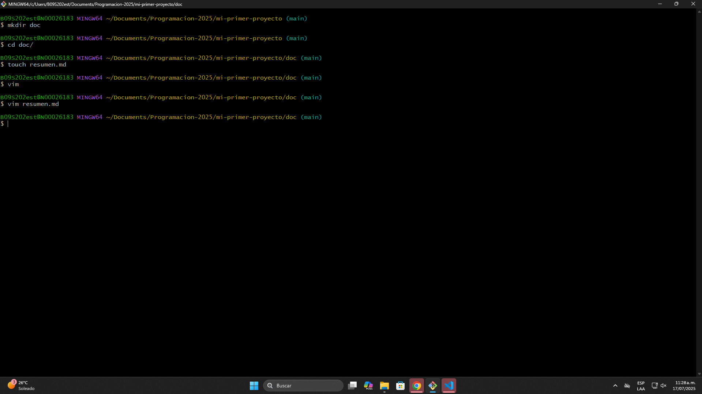

**En la sesión dos de la clase de Fundamentos de Programación, enlazamos el repositorio local con uno nuevo en GitHub, de esta manera:**

1) Iniciar o Crear una cuenta de GitHub, en mi caso ya estaba creada.
2) Crear un repositorio nuevo en GitHub, navegando por la interfaz y seleccionando la opción "New Repository"
3) Nos aseguramos que el repositorio de GitHub tenga el mismo nombre que el repositorio local, a la vez que hacerlo publico.
4) Al crear esto, abrimos Git y con el comando "cd" hasta la carpeta "mi-primer-proyecto" y usamos el comando "git remote add origin" seguido del link proporcionado por GitHub.
5) Usamos el comando "git remote -v" y nos aseguramos que hayan dos direcciones, una para fetch y otra para push.
6) Hicimos el comando "git push origin -u" para autenticarnos con la cuenta de GitHub y empezar a subir los cambios.
7) Para finalmente subir los cambios, hacemos "git push" y recargamos la pagina del repositorio en GitHub para ver los cambios.

**Así puedes subir tus commits a GitHub de manera sencilla :D**

